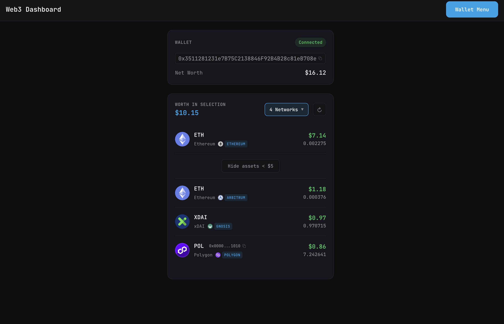

# Web3 Dashboard

A multi-chain Web3 wallet dashboard built with Nuxt 4, wagmi, viem, and Reown (WalletConnect).

## Features

- **Multi-chain Support**: Ethereum, Base, Arbitrum, Optimism, Gnosis, Polygon, Avalanche, Fantom, Celo, zkSync Era
- **Wallet Connection**: Connect via Socials, Email, WalletConnect, MetaMask, Coinbase, and more
- **Token Balances**: View ERC20 token balances across chains

## Preview



## Tech Stack

- **Framework**: Nuxt 4
- **Web3**: wagmi, viem, @reown/appkit
- **Data fetching**: @tanstack/vue-query

## Setup

Create a `.env` file in the project root:

```env
# Reown (WalletConnect) Project ID - REQUIRED
# Get yours at https://cloud.reown.com
NUXT_REOWN_PROJECT_ID=your_project_id_here

# App URL - REQUIRED for production/staging
# Used for WalletConnect metadata. Falls back to http://localhost:3000 in development.
# HTTPS is automatically enforced in production (non-localhost URLs)
NUXT_APP_URL=https://your-production-domain.com

# Zerion API Key - REQUIRED for token balance fetching
# Get yours at https://zerion.io
NUXT_ZERION_API_KEY=your_zerion_api_key_here
```

Token balances are fetched via the Zerion API, which aggregates data across all supported chains.

## License

MIT
